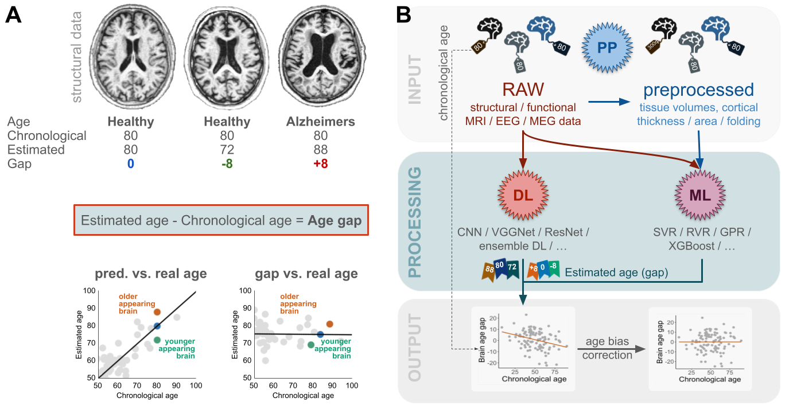

# BrainAGE

The current BrainAGE approach leverages Gaussian Process Regression (GPR) as outlined in the publication [BrainAGE: Revisited and reframed machine learning workflow](https://doi.org/10.1002/hbm.26632). This innovative method, first introduced by our team in [2010](https://doi.org/10.1016/j.neuroimage.2010.01.005), utilizes machine learning techniques to estimate brain age.

### Essential Steps for Utilizing BrainAGE:

While it's feasible to employ any segmentation of grey and white matter, CAT12 is recommended for pre-processing due to its compatibility and the necessity of certain CAT12 functionalities for BrainAGE. Many tools within BrainAGE are specifically tailored for use with CAT12.

## 1. Preprocessing your MRI data

Download the [CAT12](https://neuro-jena.github.io/cat) and use both the [CAT12 Manual](https://neuro-jena.github.io/cat12-html) and the introductory chapters, including the [Getting Started](https://neuro-jena.github.io/cat12-help/#get_started) and [Quick Start Guide](https://neuro-jena.github.io/cat12-html/cat_starting.html) to start using CAT12.
For BrainAGE analysis, we use the affinely registered segmentations of grey and white matter. It is possible to follow the default segmentation settings in CAT12 and modify certain options to speed up processing by omitting non-linear registration and surface extraction. This step is optional unless analysis of voxel- and surface-based morphometry data is also desired:

- enable 'Grey matter -> DARTEL export -> Affine'
- enable 'White matter -> DARTEL export -> Affine'

If you don't want to analyze voxel-based morphometry data:
- disable 'Process Volume ROIs'
- disable 'Grey matter -> Modulated normalized'
- disable 'White matter -> Modulated normalized'
- disable 'Bias, noise and global intensity corrected T1 image -> Normalized'
- disable 'Deformation Fields -> Image->Template (forward)'

If you don't want to analyze surface-based morphometry data:
- disable 'Surface and thickness estimation'

You can also use the CAT12 shell scripts:

        cat_batch_cat.sh -ns -nm -rp your_T1_data.nii

The used flags are:

        -ns    skip surface and thickness estimation
        -nm    skip estimating modulated and warped segmentations and ROI measures
        -rp    additionally estimate affine registered segmentations

Finally, carefully check the quality of the pre-processed data using the sample-homogeneity tool in CAT12. More information can be found [here](https://neuro-jena.github.io/cat12-help/#module4).

## 2. Organize Pre-processed Data

Use the abbreviations 'rp1' and 'rp2' to denote affinity-registered grey matter and white matter segmentations, respectively. Before proceeding to the next stage, separate the 'rp1' and 'rp2' files into separate folders, clearly labelled with the CAT12 version used. Move all 'rp1' and 'rp2' files into their respective folders:

        YourDataFolder/rp1_CAT12.9
        YourDataFolder/rp2_CAT12.9

## 3. Resample and Smooth Pre-processed Data

The BA_data2mat function is designed to prepare pre-processed data for machine learning analysis by converting spatially registered volumes into Matlab .mat files. It masks out non-brain areas by applying a mask to the volume data to ensure that only relevant brain information is included, and performs resampling and smoothing of the data at different scales (e.g. 4/8mm for both processes).

        D.age   = load(YourAgeTextFile);  % Load your age information
        D.male  = load(YourMaleTextFile); % Load information about male/female (1/0)
        
        D.release='_CAT12.9';      % Release or version information of the data
        D.name = 'YourDataName';   % Base name for the output .mat file.
        D.data = {YourDataFolder}; % Cell array of strings; paths to data folders to be concatenated.
        
        BA_data2mat(D); % call BA_data2mat to save mat-files of resampled and smoothed data

This function outputs segmented, smoothed and resampled volumes as .mat files in specified or default directories. For example, using the above parameters, the output files will be:

        s8_8mm_rp1_YourDataName_CAT12.9.mat
        s8_8mm_rp2_YourDataName_CAT12.9.mat
        s4_8mm_rp1_YourDataName_CAT12.9.mat
        s4_8mm_rp2_YourDataName_CAT12.9.mat
        s8_4mm_rp1_YourDataName_CAT12.9.mat
        s8_4mm_rp2_YourDataName_CAT12.9.mat
        s4_4mm_rp1_YourDataName_CAT12.9.mat
        s4_4mm_rp2_YourDataName_CAT12.9.mat

If you have defined multiple folders for `D.data` (e.g. D.data = {YourDataFolder1,YourDataFolder2}), the data from the specified folders will be concatenated (first 'YourDataFolder1', then 'YourDataFolder2') and saved in a single .mat file format for each segmentation. When using data from multiple folders (e.g. combining data from control and patient groups), ensure that all pre-processed files are arranged in an orderly manner according to subject age and gender. 

## 4. BrainAGE Estimation

<https://www.markdownguide.org>
<fake@example.com>

