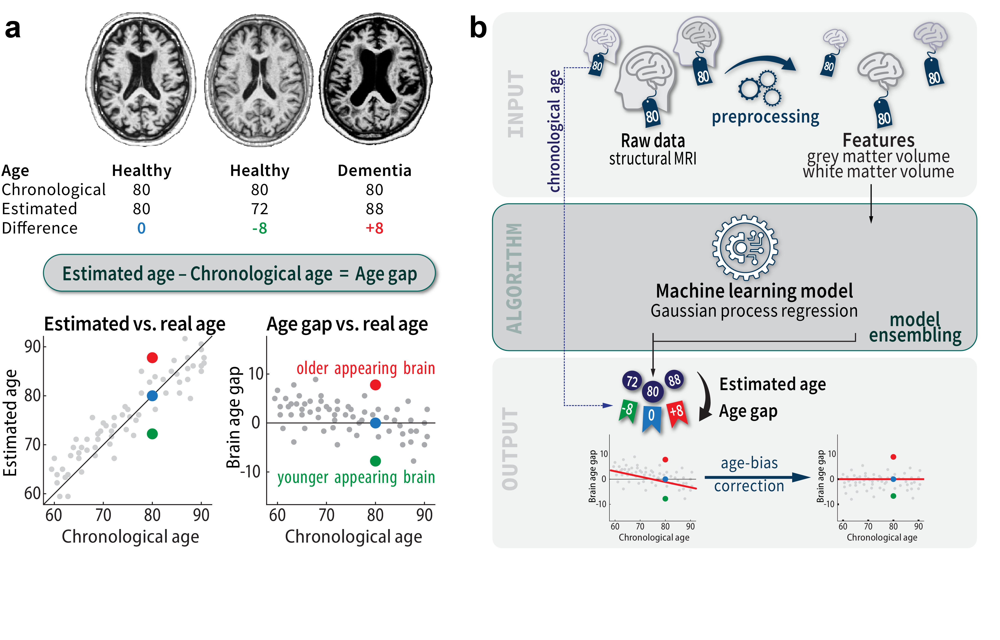
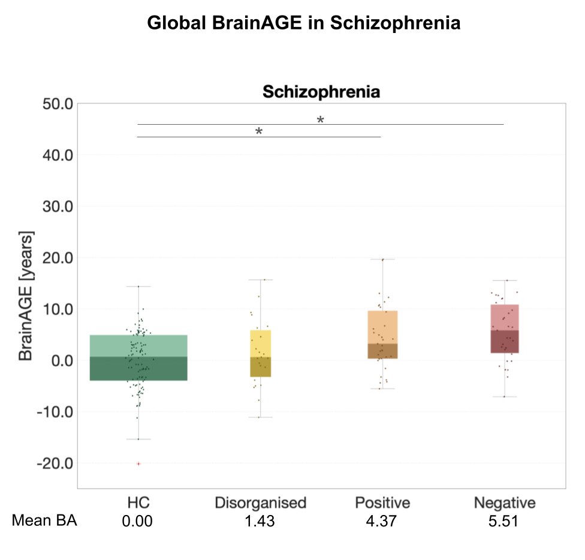
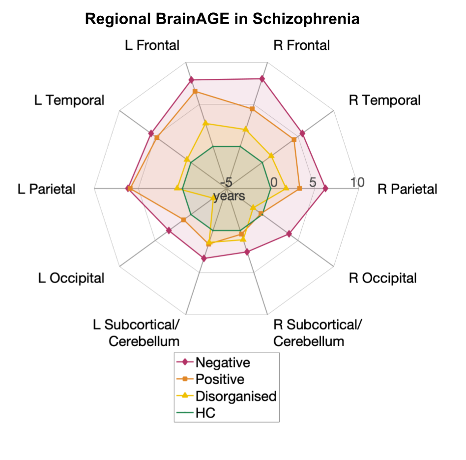

# BrainAGE


BrainAGE Estimation

The current BrainAGE approach leverages Gaussian Process Regression (GPR) as outlined in the publication [BrainAGE: Revisited and reframed machine learning workflow](https://doi.org/10.1002/hbm.26632). This innovative method, first introduced by our team in [2010](https://doi.org/10.1016/j.neuroimage.2010.01.005), utilizes machine learning techniques to estimate brain age.

### Essential Steps for Utilizing BrainAGE:

While it's feasible to employ any segmentation of grey and white matter, CAT12 is recommended for pre-processing due to its compatibility and the necessity of certain CAT12 functionalities for BrainAGE. Many tools within BrainAGE are specifically tailored for use with CAT12.

## 1. Preprocessing your MRI data

Download the [CAT12](https://neuro-jena.github.io/cat) and use both the [CAT12 Manual](https://neuro-jena.github.io/cat12-html) and the introductory chapters, including the [Getting Started](https://neuro-jena.github.io/cat12-help/#get_started) and [Quick Start Guide](https://neuro-jena.github.io/cat12-html/cat_starting.html) to start using CAT12.
For BrainAGE analysis, we use the affinely registered segmentations of grey and white matter. It is possible to follow the default segmentation settings in CAT12 and modify certain options to speed up processing by omitting non-linear registration and surface extraction. This step is optional unless analysis of voxel- and surface-based morphometry data is also desired:

- enable `Grey matter -> DARTEL export -> Affine`
- enable `White matter -> DARTEL export -> Affine`

If you don't want to analyze voxel-based morphometry data:
- disable `Process Volume ROIs`
- disable `Grey matter -> Modulated normalized`
- disable `White matter -> Modulated normalized`
- disable `Bias, noise and global intensity corrected T1 image -> Normalized`
- disable `Deformation Fields -> Image->Template (forward)`

If you don't want to analyze surface-based morphometry data:
- disable `Surface and thickness estimation`

You can also use the CAT12 shell scripts:

```
cat_batch_cat.sh -ns -nm -rp your_T1_data.nii
```

The used flags are:

```
-ns    skip surface and thickness estimation
-nm    skip estimating modulated and warped segmentations and ROI measures
-rp    additionally estimate affine registered segmentations
```

Finally, carefully check the quality of the pre-processed data using the sample-homogeneity tool in CAT12. More information can be found [here](https://neuro-jena.github.io/cat12-help/#module4).

## 2. Organize Pre-processed Data

Use the abbreviations 'rp1' and 'rp2' to denote affinity-registered grey matter and white matter segmentations, respectively. Before proceeding to the next stage, separate the 'rp1' and 'rp2' files into separate folders, clearly labelled with the CAT12 version used. Move all 'rp1' and 'rp2' files into their respective folders. We use an example that was described in our [recent work](https://doi.org/10.1002/hbm.26632), where 3 subgroups of patients with Schizophrenia were compared to controls subjects:

```
Jena_s87_c108/c/rp1_CAT12.9
Jena_s87_c108/c/rp2_CAT12.9
Jena_s87_c108/s1_neg_items50/rp1_CAT12.9
Jena_s87_c108/s1_neg_items50/rp2_CAT12.9
Jena_s87_c108/s2_desorg_items50/rp1_CAT12.9
Jena_s87_c108/s2_desorg_items50/rp2_CAT12.9
Jena_s87_c108/s3_halluz_items50/rp1_CAT12.9
Jena_s87_c108/s3_halluz_items50/rp2_CAT12.9
```

## 3. Resample and Smooth Pre-processed Data

The BA_data2mat function is designed to prepare pre-processed data for machine learning analysis by converting spatially registered volumes into Matlab .mat files. It masks out non-brain areas by applying a mask to the volume data to ensure that only relevant brain information is included, and performs resampling and smoothing of the data at different scales (e.g. 4/8mm for both processes as default for rp1 and rp2):

```
% Load age information for a control sample and 3 different sub-groups 
% of schizophrenic patients
age_c  = load('Jena_s87_c108/tables/c108_age.txt');
age_s1 = load('Jena_s87_c108/tables/s1_promax_items50_rated_age.txt');
age_s2 = load('Jena_s87_c108/tables/s2_promax_items50_rated_age.txt');
age_s3 = load('Jena_s87_c108/tables/s3_promax_items50_rated_age.txt');

% Do the same for information about sex which is coded male=1, female=0
male_c  = load('Jena_s87_c108/tables/c108_male.txt');
male_s1 = load('Jena_s87_c108/tables/s1_promax_items50_rated_male.txt');
male_s2 = load('Jena_s87_c108/tables/s2_promax_items50_rated_male.txt');
male_s3 = load('Jena_s87_c108/tables/s3_promax_items50_rated_male.txt');

% Combine age and sex information
D.age  = [age_c; age_s1; age_s2; age_s3];
D.male  = [male_c; male_s1; male_s2; male_s3];

% Release or version information of the data
D.release='_CAT12.9';

% Basename for the output .mat file
% Personally I always use size of the groups in the name.
D.name = 'Jena_s87_c108';

% Cell array of strings; paths to data folders to be concatenated
% Here we have organized the data in 4 different subfolders for the groups.
D.data = {'Jena_s87_c108/c/','Jena_s87_c108/s1_neg_items50/',...
    'Jena_s87_c108/s2_desorg_items50/','Jena_s87_c108/s3_halluz_items50/'};

% Call BA_data2mat to save mat-files of resampled and smoothed data
BA_data2mat(D);
```

This function outputs segmented, smoothed and resampled volumes as .mat files in specified or default directories. For example, using the above parameters, the output files will be:

```
s8_8mm_rp1_Jena_s87_c108_CAT12.9.mat
s8_8mm_rp2_Jena_s87_c108_CAT12.9.mat
s4_8mm_rp1_Jena_s87_c108_CAT12.9.mat
s4_8mm_rp2_Jena_s87_c108_CAT12.9.mat
s8_4mm_rp1_Jena_s87_c108_CAT12.9.mat
s8_4mm_rp2_Jena_s87_c108_CAT12.9.mat
s4_4mm_rp1_Jena_s87_c108_CAT12.9.mat
s4_4mm_rp2_Jena_s87_c108_CAT12.9.mat
```

If you have defined multiple folders for `D.data` such as in the example above, the data from the specified folders will be concatenated (first 'Jena_s87_c108/c', then 'Jena_s87_c108/s1_neg_items50' and so on) and saved in a single .mat file format for each segmentation. When using data from multiple folders, ensure that all pre-processed files are arranged in an orderly manner according to subject age and gender.

If you intend to include other morphometric measures (e.g. rp3 for CSF), see the BA_data2mat help text for a more detailed description of the available options.

## 4. BrainAGE Estimation
The function `BA_gpr_ui` is the core function to estimate BrainAGE. If you need more information, use the help function to see all the available options.

```
% Basename for the output .mat file
D.data    = 'Jena_s87_c108';

% Release or version information of the data
D.relnumber = '_CAT12.9';

% Char array of the group names
D.name_groups = char('Negative','Positive','Disorganised','Controls');

% Index for each group
% Here we used a deviating order to show control subject as last group
D.ind_groups  = {109:139,163:195,140:162,1:108};

% We almost always have to correct for the age-bias that leads to an understimation of 
% BrainAGE for young subjects and overstimation of elderly subjects. This 
% age-bias correction is estimated using the control subjects only and is apllied 
% to all data.
D.ind_adjust = 1:108;

% Use BrainAGE for trend correction (default linear trend)
D.trend_method = 1;

% Training data that are used for BrainAGE estimation
% In this example we combine 549 subjects from OASIS3, 547 from IXI,
% 651 from CamCan, 494 from SALD, and 516 from NKIe. This is also our
% default normative database for adults that covers a large age range
% (18..97 years)
D.train_array = {'OASIS3_549+IXI547+CamCan651+SALD494+NKIe516'};

% Age range of the training sample. This is a very important and useful parameter 
% that should be adjusted to suit your data. The age in our example data for the 
% controls and patients is 18..65 years and we choose a wider age range for the training 
% for the training data to take into account the aging effects in subjects older than 
% than 65 years, where the largest aging effects occur. In the case of much
% younger subjects (20..35 years), then an age range of 18..50 (or even 60)
% may be more appropriate to take into account the different age trajectories 
% at younger ages.
D.age_range = [18 80];

% Be verbose
D.verbose = 1;

% Use resampling of 4 and 8mm
D.res_array    = char('4','8');  % resampling resolution

% Use smoothing of 4 and 8mm
D.smooth_array = char('s4','s8'); % smoothing size

% Use rp1 and rp2 images (grey and white matter)
D.seg_array    = {'rp1','rp2'};

% This defines the ensemble method to combine the different models (e.g. 4/8mm resampling,
% 4/8mm smoothing, rp1/rp2). Here, we use 'Weighted Average', which averages
%  all models with weighting w.r.t. squared MAE.
D.ensemble = 5;        

% Call GPR method for estimating BrainAGE
% The estimated BrainAGE values are returned in the order you have defined
% using 'D.ind_groups' and also in the original (unsorted) order.
% Boxplots and some basic statistics are also provided during the estimation
% process.        
[BA, BA_unsorted] = BA_gpr_ui(D);
```


Global BrainAGE Estimation in Schizophrenia

## 5. Regional BrainAGE Estimation
We have recently also introduce our local BrainAGE approach that uses this [parcellation](https://doi.org/10.1007/s00429-009-0203-y) into lobes to additionally estimate local BrainAGE values.


Lobe Parcellation for Regional BrainAGE [Source](https://doi.org/10.1007/s00429-009-0203-y).


In order to estimate regional BrainAGE, simply add the following lines to the script above:
```
% Use parcellation
D.parcellation = 1;

% Show spider (radar) plot with mean values
D.spiderplot.func = 'mean';

% Range for spiderplot (default automatically find range)
D.spiderplot.range = [-5 10];
```


Regional BrainAGE Estimation in Schizophrenia

